[한국어 (기본)](./README.md)

# Urimodu ERP

Self-hosted, Apache-2.0 open-source ERP/work platform with Korean-first business workflow design.

## Project Status

`v0.1.0-alpha.0` prerelease preparation is in progress.

Current repository baseline includes completed scope from `PROMPT02` through `PROMPT07`:

- runnable monorepo and deployment scaffolding
- core modular-monolith API and web UI
- document and approval workflow baseline
- attendance/leave integration and edge-agent scaffold
- expenses/finance/import-export starter
- operational docs, ADRs, and smoke check foundation

This is an **alpha prerelease candidate** for early adopters and contributors, not a production GA.

## Alpha Feedback

We are actively collecting post-release alpha feedback.

- Announcement issue: [#25](https://github.com/pxzhu/urimodu-erp/issues/25)
- Feedback tracker: [#19](https://github.com/pxzhu/urimodu-erp/issues/19)
- Stabilization milestone: `v0.1.1-alpha.1` ([Milestones](https://github.com/pxzhu/urimodu-erp/milestones))
- Report a new issue: [New issue form](https://github.com/pxzhu/urimodu-erp/issues/new/choose)

## Core Modules Implemented So Far

- `auth`: local session auth + RBAC + OIDC-ready abstraction
- `org`: company/legal entity/business site/department baseline
- `employee`: employee master with masking and audit hooks
- `files`: MinIO-backed file object metadata + retrieval
- `documents`: template/version/attachment and PDF rendering flow
- `approvals`: submit/approve/reject workflow baseline
- `signatures`: signature/seal asset starter
- `attendance`: raw event ingestion + normalized ledger model
- `leave`: leave requests and attendance correction starter
- `expenses`: expense claim starter
- `finance`: chart of accounts and journal entry starter
- `import-export`: import/export jobs with row-level reporting
- `integrations`: generic ingress contract + connector gateway
- `audit`: key mutation audit logs

## Screenshots

Captured from a seeded local stack with Korean-first defaults (light mode + sidebar shell).  
Capture inventory and recapture guide: [docs/screenshots/README.md](./docs/screenshots/README.md)

### Admin View

#### AI-Native ERP Landing (`/`)

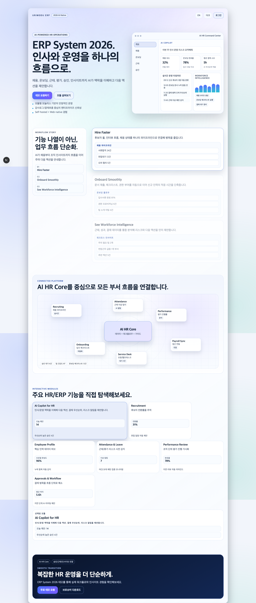

#### Employees Directory (`/employees`)

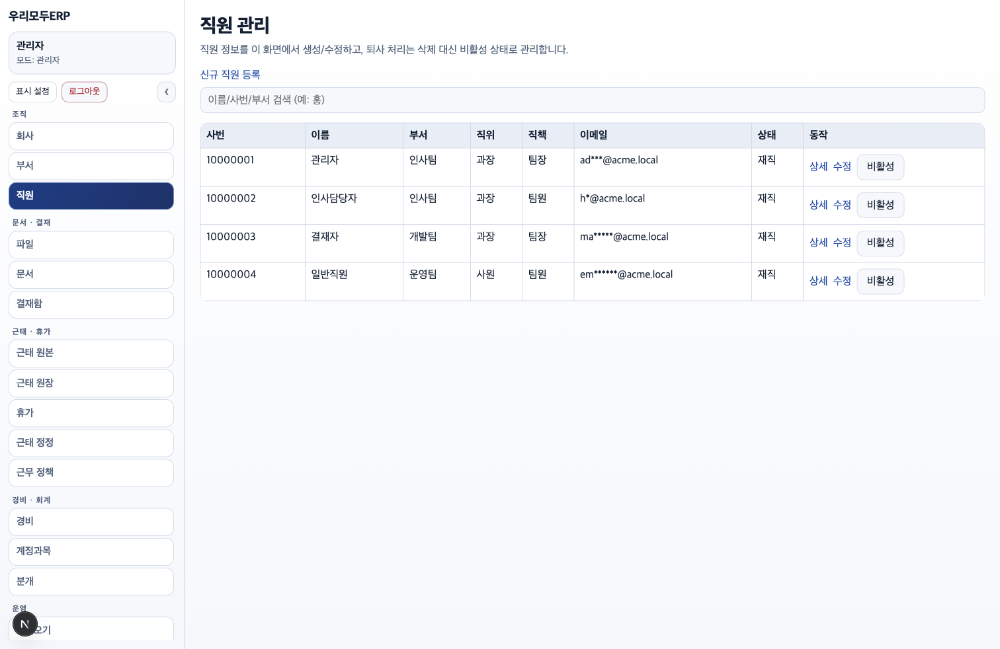

#### Documents And Templates (`/documents`)

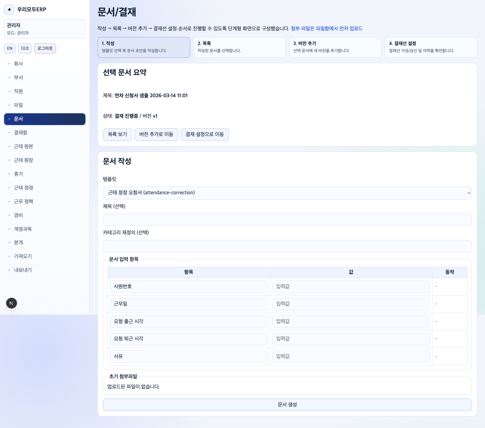

#### Approvals Inbox (`/approvals`)

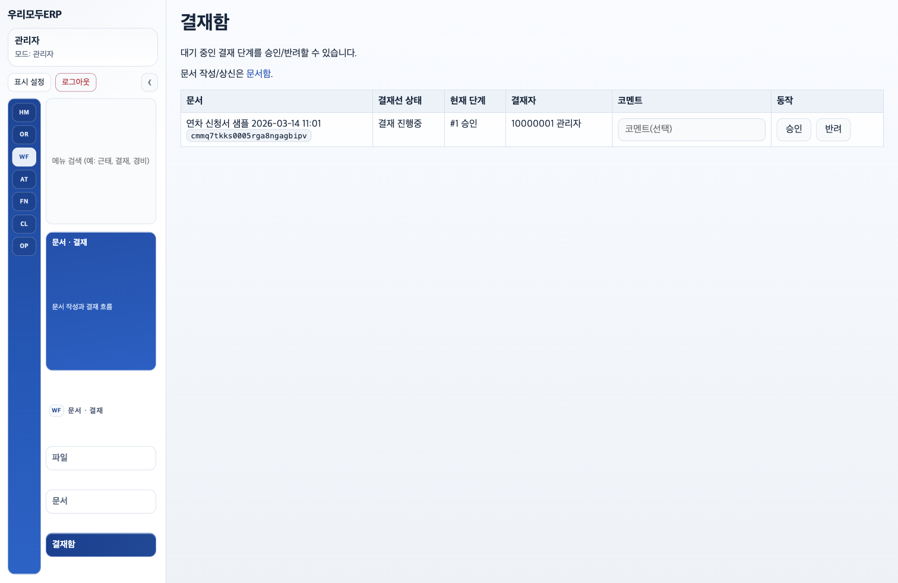

#### Attendance Ledger (`/attendance/ledger`)

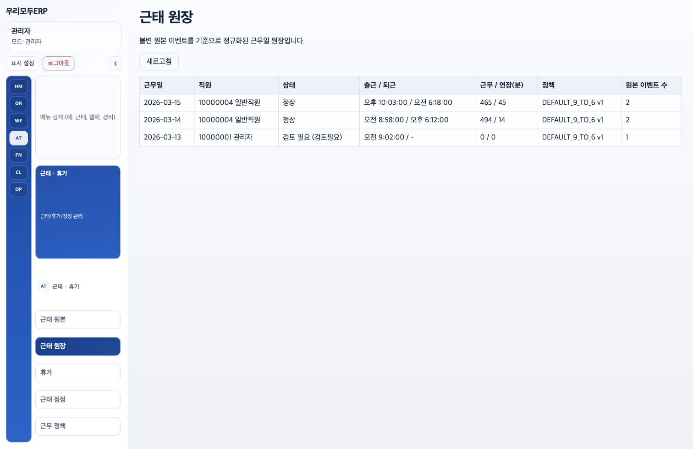

#### Expense Claims (`/expenses`)

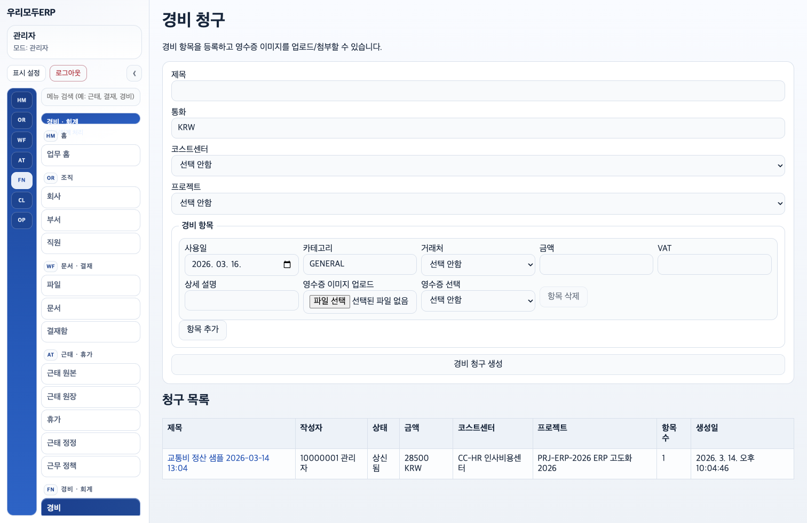

### User View

#### AI-Native ERP Landing (`/`)

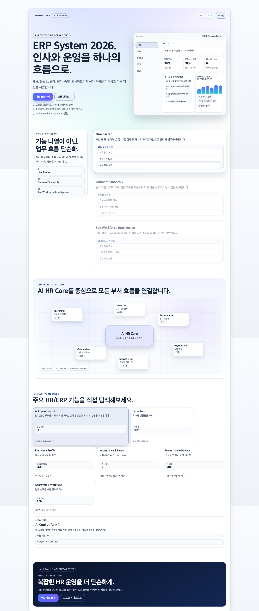

#### Employees Directory (`/employees`)

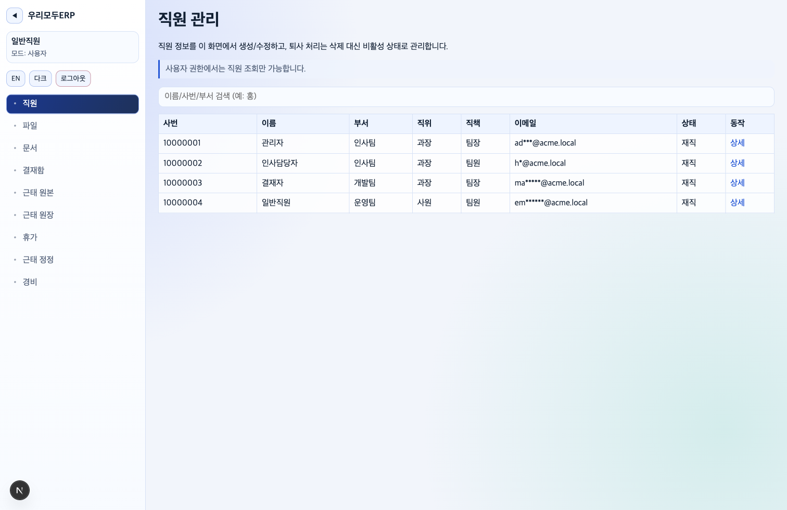

#### Documents And Templates (`/documents`)

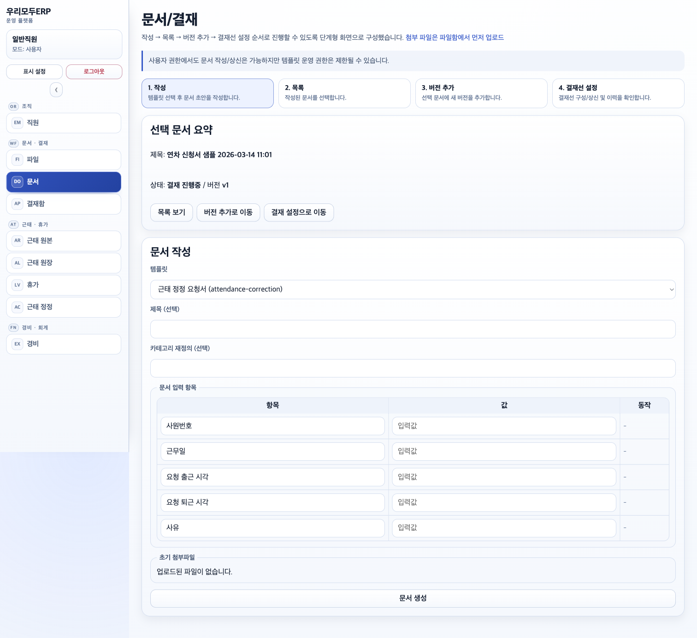

#### Approvals Inbox (`/approvals`)

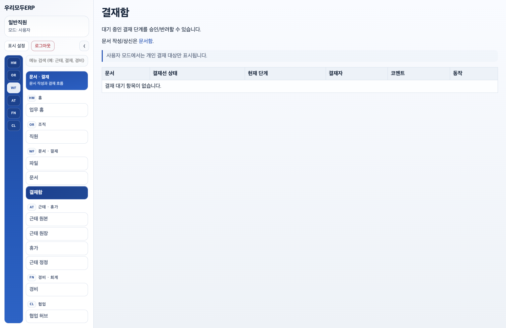

#### Attendance Ledger (`/attendance/ledger`)

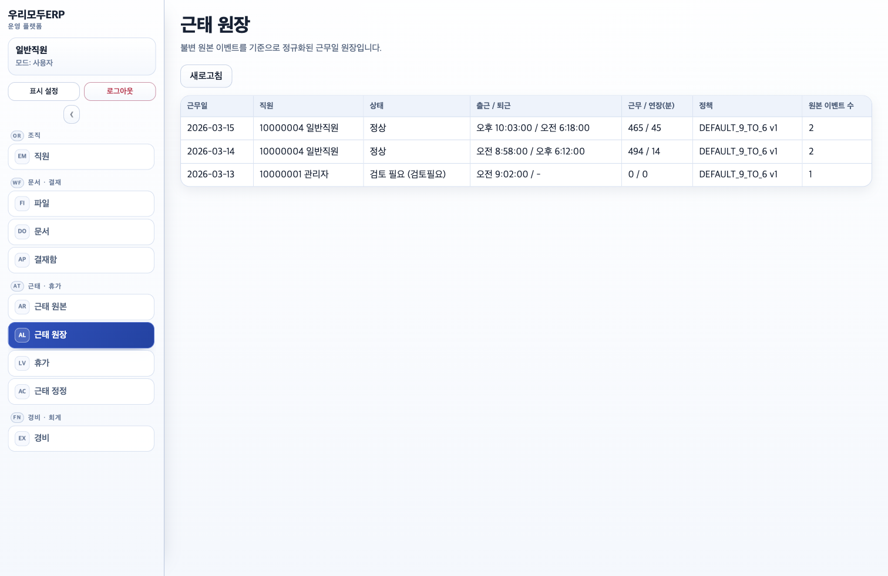

#### Expense Claims (`/expenses`)

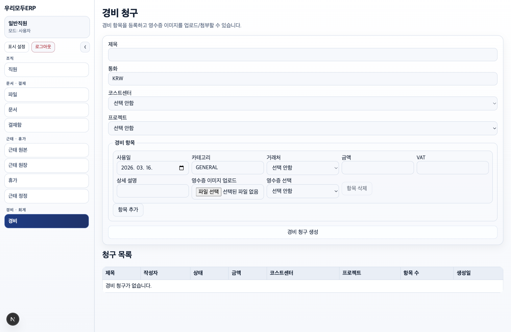

## Quickstart

### Prerequisites

- Node.js 20+
- pnpm 10+
- Docker / Docker Compose (recommended)
- Go 1.19+ (if running edge-agent locally)

### Local Boot

```bash
make bootstrap
cp .env.example .env
cp deploy/compose/.env.example deploy/compose/.env
make compose-up
pnpm --filter @korean-erp/api prisma:seed
pnpm dev
```

### Local Endpoints

- Web: `http://localhost:3000`
- API: `http://localhost:4000`
- Swagger UI: `http://localhost:4000/swagger`
- OpenAPI JSON: `http://localhost:4000/swagger-json`
- Worker health: `http://localhost:4100/health`
- Connector gateway health: `http://localhost:4200/health`
- Docs service health: `http://localhost:4300/health`

### Seeded Accounts

- `admin@acme.local`
- `hr@acme.local`
- `manager@acme.local`
- `employee@acme.local`

Default password: `ChangeMe123!` (override with `SEED_DEFAULT_PASSWORD`)

### Smoke Check

```bash
make smoke
```

### Helm Check (Local Helm Optional)

```bash
make helm-lint
make helm-template
```

The Helm wrapper (`scripts/helmw.sh`) uses local `helm` when available and falls back to Docker `alpine/helm`.

### QA Archive Workflow

```bash
pnpm qa:init
pnpm qa:validate
pnpm qa:navigation
pnpm qa:navigation:headed
pnpm qa:screenshots
```

Complete the generated checklist files under `docs/qa/runs/<run-id>/` for API/page/feature-level evidence.
`qa:navigation` validates repeated desktop/mobile navigation flows for admin, HR manager, and employee roles.

## Roadmap / What Comes Next

See [docs/roadmap.md](./docs/roadmap.md).

Planned next focus areas:

- payroll
- advanced accounting
- deeper ADT/S1 adapters
- HWPX export hardening
- mobile app
- notification integrations

## Support and Contributing

- Vision: [VISION.md](./VISION.md) / [VISION.en.md](./VISION.en.md)
- Contributing guide: [CONTRIBUTING.md](./CONTRIBUTING.md)
- Security policy: [SECURITY.md](./SECURITY.md)
- Issues: [GitHub Issues](https://github.com/pxzhu/urimodu-erp/issues)

## Documentation Map

- Execution plan log: [docs/PLAN.md](./docs/PLAN.md)
- Architecture diagrams: [docs/architecture/README.md](./docs/architecture/README.md)
- ADRs: [docs/adr](./docs/adr)
- API notes: [docs/api/README.md](./docs/api/README.md)
- QA archive guide: [docs/qa/README.md](./docs/qa/README.md)
- Operations notes: [docs/ops/README.md](./docs/ops/README.md)
- Release notes draft: [docs/releases/v0.1.0-alpha.0.md](./docs/releases/v0.1.0-alpha.0.md)
- Changelog: [CHANGELOG.md](./CHANGELOG.md)

## License

Apache-2.0 ([LICENSE](./LICENSE))
