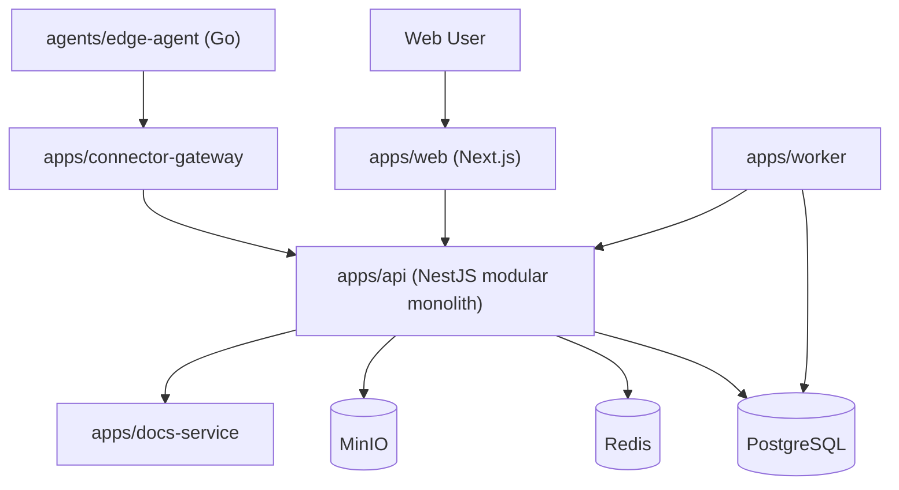
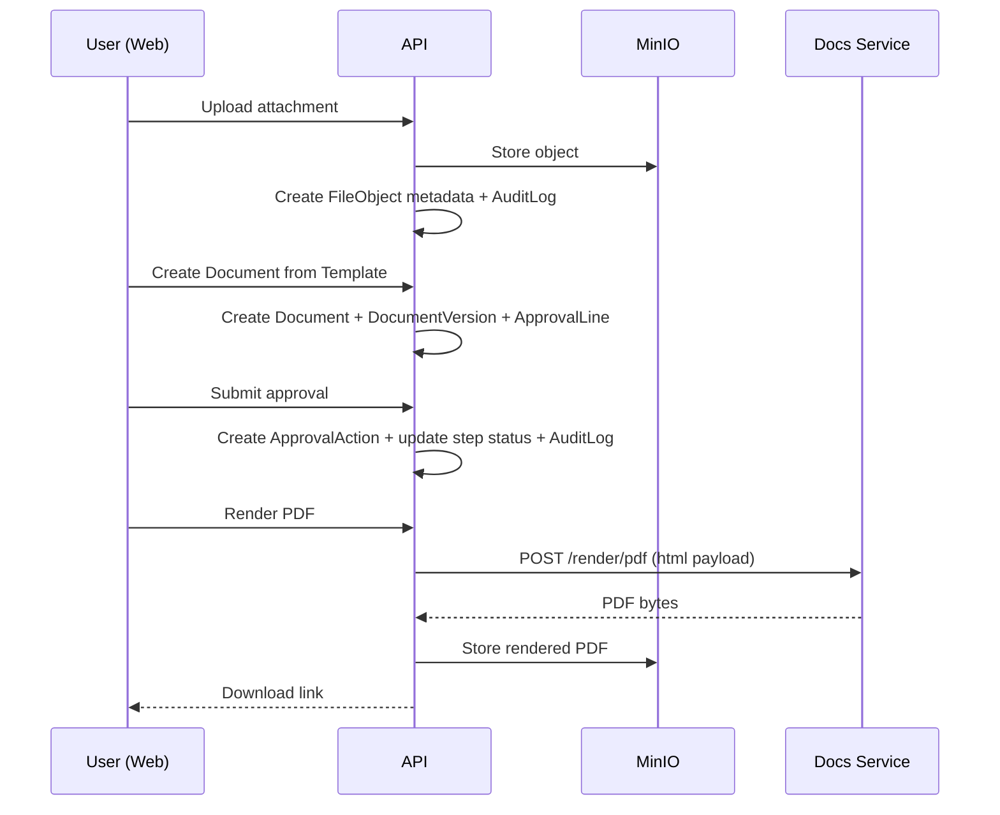
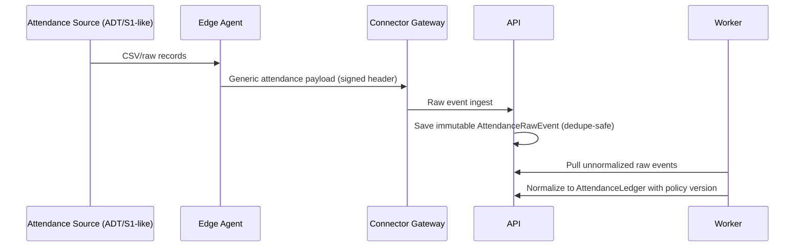

# Architecture Overview

This document summarizes the current implementation topology for PROMPT02-PROMPT07.

## System Topology

## Document and Approval Flow

## Attendance Integration Flow

## Design Constraints

- Core business API remains a modular monolith.
- HWPX is first-class document strategy; legacy HWP stays fallback-only.
- Raw attendance events are immutable sources; ledgers are normalized views.
- Important mutations produce audit logs.

## Related ADRs

- `docs/adr/0001-modular-monolith.md`
- `docs/adr/0002-hwpx-first.md`
- `docs/adr/0003-edge-agent-strategy.md`
- `docs/adr/0004-attendance-raw-vs-ledger.md`
- `docs/adr/0005-self-hosted-topology.md`
